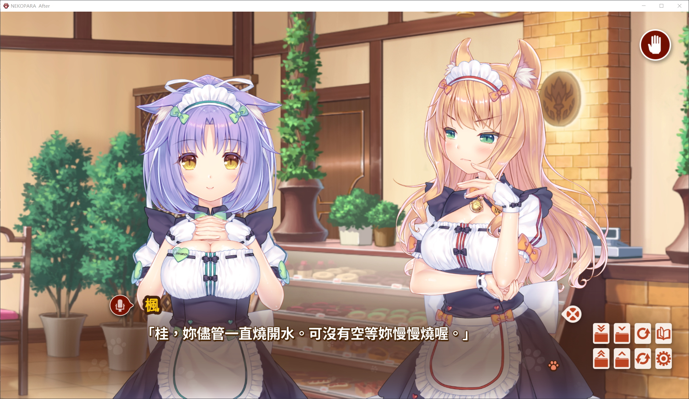

# NEKOPARA 繁转简补丁

通过 `winmm.dll` 文字 Hook，将游戏渲染的繁体中文字形转换为简体。

已确认 NEKOPARA After 的剧情正文转换生效。主菜单和设置界面的图片文字不在当前补丁的转换范围内；其他版本尚未验证。

## 效果对比

| 使用前：繁体中文 | 使用后：简体中文 |
| --- | --- |
|  |  |

## 下载与安装

从 [Releases](https://github.com/half-drop/NEKOPARA-T2S/releases/latest) 下载 `NEKOPARA-T2S.zip`。

1. 保存并退出游戏。
2. 解压，将 `winmm.dll` 和 `uif_config.json` 复制到游戏 EXE 所在目录。
3. 如有同名文件，先备份，再替换。启动游戏即可。

此包为 32 位 DLL。不要放入 Windows 或 System32 目录。

## 卸载

关闭游戏，删除本包的 `winmm.dll` 和 `uif_config.json`；如有原文件备份，恢复备份。

## 来源与范围

基于 [UniversalInjectorFramework](https://github.com/AtomCrafty/UniversalInjectorFramework)，使用 Windows 繁简字形映射。

这里只发布用户提供的成品压缩包，未修改包内文件。不是官方补丁，也不是所有游戏通用的补丁。字形转换不会自动改写港台词汇或图片中的文字。
